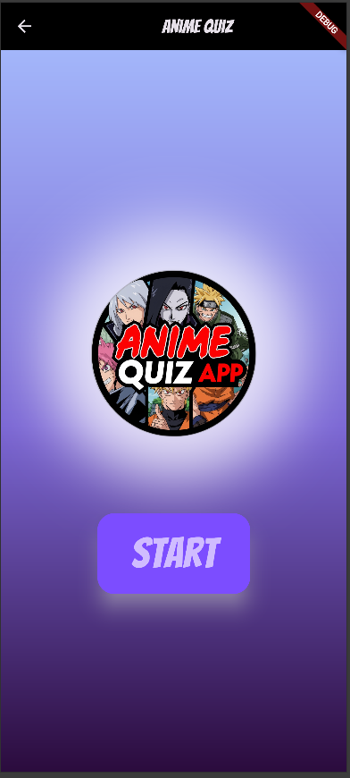
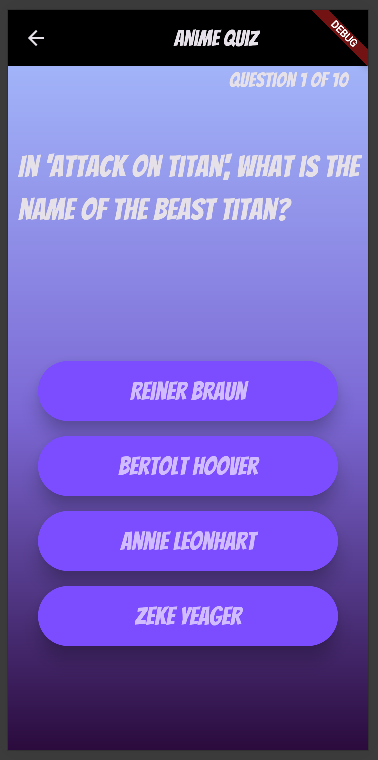

# Anime Quiz App

A Flutter-based quiz application focused on anime trivia questions. This project was created as a learning exercise to explore Flutter development, Firebase integration, and mobile app architecture.

## About

This app presents users with multiple-choice questions about various anime series. Players answer 10 random questions and receive their final score with celebratory animations for perfect scores. The project demonstrates fundamental Flutter concepts including state management, navigation, Firebase integration, and responsive UI design.

I built this app primarily to learn Flutter development and gain hands-on experience with mobile app development patterns. It covers essential topics like working with external databases, handling asynchronous operations, and creating engaging user interfaces.

## Features

- Random selection of 10 quiz questions from a Firebase database
- Multiple choice answers with visual feedback
- Score tracking throughout the quiz
- Congratulatory animations for high scores
- Admin panel for adding new questions
- Responsive design with custom gradient backgrounds

## Screenshots
### Homepage


*Clean homepage with the app logo and start button*

### Quiz Questions
 

*Question screen showing Attack on Titan trivia with multiple choice options*

### Results Screen


*Results screen with confetti animation for perfect scores*

## Tech Stack

- **Flutter** - Cross-platform mobile development framework
- **Firebase Firestore** - NoSQL database for storing quiz questions
- **Firebase Core** - Firebase SDK integration
- **Google Fonts** - Custom typography (Bangers font)
- **Confetti Package** - Celebration animations


### Prerequisites

- Flutter SDK installed
- Firebase project set up
- Android Studio or VS Code with Flutter extensions

### Installation

- Clone the repository

- git clone [your-repo-url]
    cd anime-quiz-app

- Install dependencies

- bashflutter pub get

- Configure Firebase

- Create a new Firebase project
- Enable Firestore Database
- Download google-services.json (Android) and GoogleService-Info.plist (iOS)
- Place them in the appropriate platform folders
- Update firebase_options.dart with your project configuration
- Add quiz questions to Firestore

- Use the admin panel in the app, or
- Manually add documents to the "questions" collection with this structure:


```json   {
     "question": "Your question here?",
     "options": ["Option 1", "Option 2", "Option 3", "Option 4"],
     "correctAnswerIndex": 0
   }
```

- Run the app


### What I Learned
Through building this project, I gained experience with:

- Flutter Fundamentals: Widget composition, state management, and navigation
- Firebase Integration: Setting up Firestore, handling real-time data, and managing asynchronous operations
- UI/UX Design: Creating responsive layouts, custom themes, and engaging animations
- Error Handling: Implementing proper error states and user feedback
- Code Organization: Structuring a Flutter project with separation of concerns
- External Packages: Integrating third-party packages for fonts and animations